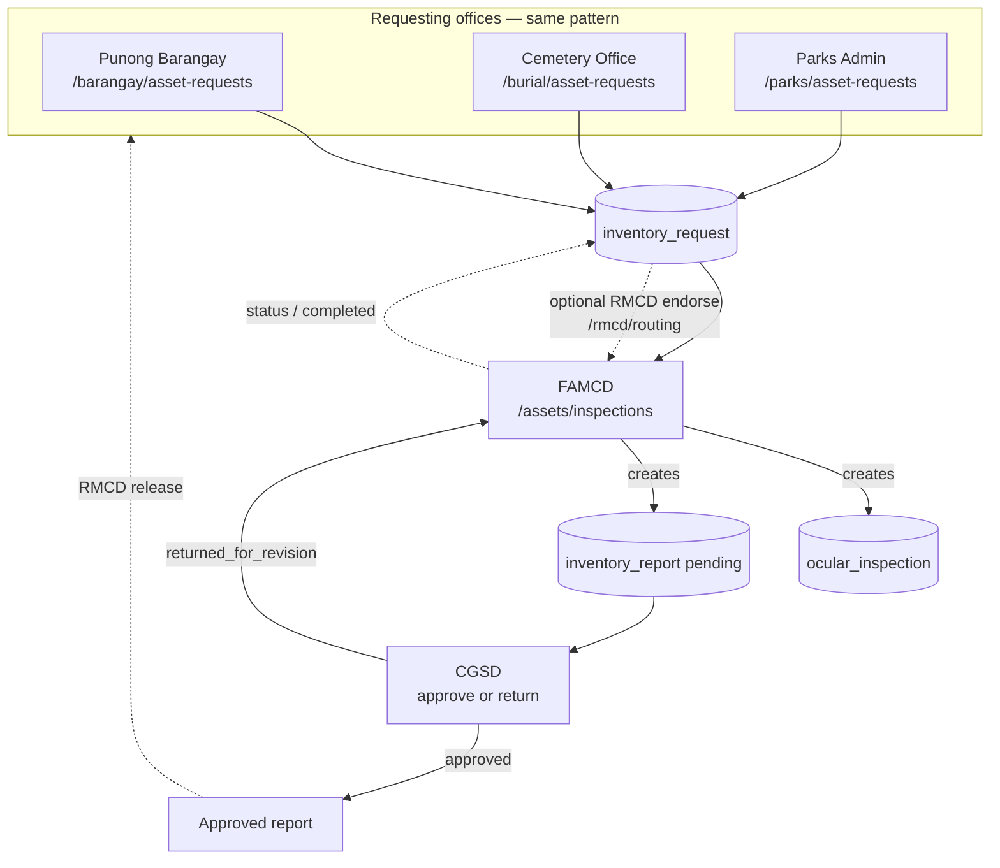

## Routing focus: FAMCD, CGSD, Punong Barangay, Cemetery Office, Parks Admin

There is **no direct URL hand-off** between these roles. They coordinate through **shared records** (`inventory_request`, `inventory_report`, `ocular_inspection`, `approval_record`). The tables below describe **who routes work to whom** (forward) and **what comes back** (vice versa).

### App routes each role uses for this workflow

| Role | Submit / track own requests | See inventory & reports | Inspect / approve |
|------|----------------------------|------------------------|-------------------|
| **Punong Barangay** | `/barangay/asset-requests` | `/assets/inventory` (if in nav) | — |
| **Cemetery Office** | `/burial/asset-requests` | `/assets/inventory` | — |
| **Parks Admin** | `/parks/asset-requests` | `/assets/inventory` | — |
| **FAMCD** | — (optional `/assets/requests`) | `/assets/inventory`, `/assets/reports` | **`/assets/inspections`** (ocular queue + submit) |
| **CGSD Management** | — | `/assets/inventory`, `/assets/reports` | **`/assets/approvals`** (non-ocular reports); ocular-backed reports: see §4 / `cgsd_management/ocular-inspections.tsx` |

*RMCD (`/rmcd/routing`, `/rmcd/releases`) sits between requesting offices and FAMCD/CGSD for endorsement and final release; see §2.*

### Forward routing (who sends work to whom)

| From | To | Mechanism | What moves |
|------|-----|-----------|------------|
| **Punong Barangay** | **FAMCD** (via system) | Insert `inventory_request` with `requesting_office` = Barangay Secretariat | Scope, priority, docs → shared queue |
| **Cemetery Office** | **FAMCD** (via system) | Same pattern, office = Cemetery Office | Same |
| **Parks Admin** | **FAMCD** (via system) | Same pattern, office = Parks & Recreation Administration | Same |
| **Punong Barangay / Cemetery / Parks** | **RMCD** (via system) | Same row visible on `/rmcd/routing` | Pending / in-progress requests for endorsement |
| **RMCD** | **FAMCD** | Update `inventory_request.status` → `in_progress` (“Endorse to FAMCD”) | Request stays same id; status hand-off |
| **FAMCD** | **CGSD** | Insert `ocular_inspection` + `inventory_report` (`approval_status: pending`) | Inspection + draft report |
| **CGSD** | **RMCD / requesting office** (downstream) | Approve report → later RMCD “release” | Approved `inventory_report` → `approval_record` (released) |

### Vice versa (return / backward paths)

| From | To | Mechanism | Meaning |
|------|-----|-----------|---------|
| **CGSD** | **FAMCD** | `inventory_report.approval_status` → `returned_for_revision` (+ `approval_record`) | Report sent back for correction; FAMCD revises and resubmits through inspection/submission flow. |
| **FAMCD** | **Punong Barangay / Cemetery / Parks** | No dedicated “send back” screen | Requesting offices **see status** on their asset-requests page (`pending` → `In Progress` → `Approved` mapped from DB). |
| **CGSD** | **Punong Barangay / Cemetery / Parks** | Indirect | After CGSD approves and RMCD releases, offices see outcome via **their** request/report visibility (and any future notifications). |

### Bidirectional diagram (FAMCD ↔ CGSD ↔ requesting offices)

**Summary:** Requesting offices **push** one way into `inventory_request`. **FAMCD pulls** from the inspection queue and **pushes** to CGSD via reports. **CGSD can push back** to FAMCD (return). **Punong Barangay, Cemetery Office, and Parks Admin** do not route to each other; they only **read** their own rows and downstream status.

---

## 1. Where each office submits requests